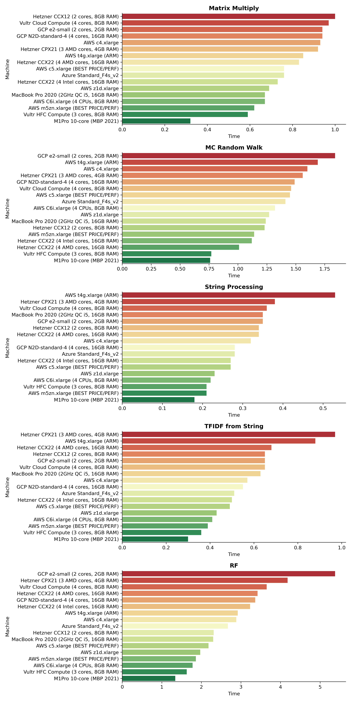

# Python Benchmarks 💻
A couple of ML-related benchmarks for testing CPU performance of different machines

# TL;DR 🥇
- Compute with little memory: `C6i` (cheapest) or `Vultr HFC`
- Compute with normal memory: `m5zn`
- Compute with a lot of memory: `z1d`


# Stats Table 📊
Seconds taken for task completion (lower is better)  
|Machine | Matrix Multiply | MC Random Walk | String Processing | TFIDF from String | RF | RF synth |
|-----|:---:|:---:|:---:|:---:|:---:|:---:|
|**Hetzner CPX21 (3 AMD cores, 4GB RAM)**| 0.92 |1.56 | 0.38 |0.97 | 4.18 | 49.9 |
|**MacBook Pro 2020 (2GHz QC i5, 16GB RAM)** | 0.67 | 1.24 | 0.35 | 0.63 |2.30 | |
|**M1Pro 10-core (MBP 2021)** | 0.32 | 0.76 | 0.18 | 0.30 | 1.34 | |
|**Vultr Cloud Compute (4 cores, 8GB RAM)**| 0.97 | 1.46 | 0.36 | 0.65| 3.65| |
|🥇**Vultr HFC Compute (3 cores, 8GB RAM)**|0.59 | 0.77 | 0.21 | 0.36 | 1.63| |
|**Hetzner CCX12 (2 cores, 8GB RAM)**| 1.00 | 1.23 | 0.34 | 0.65 | 2.31| |
|**Hetzner CCX22 (4 AMD cores, 16GB RAM)**| 0.83 | 1.01 | 0.34 | 0.68 | 3.42 | |
|**Hetzner CCX22 (4 Intel cores, 16GB RAM)**| 0.73 | 1.12 | 0.27 | 0.50 | 3.23 | |
|**GCP e2-small (2 cores, 2GB RAM)** | 0.94 | 1.84 | 0.35 | 0.65 | 5.38 | |
|**GCP N2D-standard-4 (4 cores, 16GB RAM)**| 0.94 | 1.49 | 0.28 | 0.55 | 3.36 | |
|**AWS c4.xlarge** | 0.93 | 1.60 | 0.32 | 0.57 |2.88 | |
|🥈**AWS c5.xlarge (Runner-Up)** | 0.76 | 1.45 | 0.27 | 0.49 | 2.18 | |
|🥇**AWS z1d.xlarge** | 0.69 | 1.27 | 0.23 | 0.43 | 1.97 | |
|🥇**AWS m5zn.xlarge (BEST PRICE/PERF)**| 0.62 | 1.14 | 0.21 | 0.39 | 1.86 | |
|**AWS t4g.xlarge (ARM)** | 0.85 | 1.69 | 0.53 | 0.88 | 2.92 | |
|**Azure Standard_F4s_v2**| 0.76 | 1.41 | 0.28 | 0.51 | 2.67 | |
|🥇**AWS C6i.xlarge (BEST PRICE/PERF)** | 0.69 | 1.34 | 0.29 | 0.56 | 2.02 | 39.6 |
|**AWS t2.xlarge** | 1.06 | 1.77 | 0.38 | 0.67 | 3.07 | |
|**AWS t3.xlarge** | 0.88 | 1.63 | 0.31 | 0.55 | 2.60 | |
|**AWS m6i.xlarge**| 0.68 | 1.45 | 0.24 | 0.44 | 3.04 | |
|**Hetzner Dedicated AX41**| 0.72 | 1.14 | 0.25 | 0.49 | 2.65 | 17.7 |
|**AWS C6i.2xlarge** | 0.69 | 1.34 | 0.29 | 0.56 | 2.34 | 20.2 |


# Beautiful DataViz



# Raw Stats

## Hetzner CPX21 (3 AMD cores, 4GB RAM)
```
============Matrix Multiply=============
AVG = 0.91745 seconds.
----------------------------------------
========Monte Carlo Random Walk=========
AVG = 1.55901 seconds.
----------------------------------------
===========String Processing============
AVG = 0.38183 seconds.
----------------------------------------
===========TFIDF from string============
AVG = 0.97871 seconds.
----------------------------------------
=========Fitting RF in parallel=========
AVG = 4.18186 seconds.
----------------------------------------
```

## MacBook Pro 2020 (2GHz Quad-Core i5, 16GB RAM)
```
============Matrix Multiply=============
AVG = 0.67405 seconds.
----------------------------------------
========Monte Carlo Random Walk=========
AVG = 1.23808 seconds.
----------------------------------------
===========String Processing============
AVG = 0.35248 seconds.
----------------------------------------
===========TFIDF from string============
AVG = 0.62952 seconds.
----------------------------------------
=========Fitting RF in parallel=========
AVG = 2.29664 seconds.
----------------------------------------
```

## Vultr Cloud Compute (4 cores, 8GB RAM)
```
============Matrix Multiply=============
AVG = 0.97056 seconds.
----------------------------------------
========Monte Carlo Random Walk=========
AVG = 1.45590 seconds.
----------------------------------------
===========String Processing============
AVG = 0.35676 seconds.
----------------------------------------
===========TFIDF from string============
AVG = 0.64996 seconds.
----------------------------------------
=========Fitting RF in parallel=========
AVG = 3.64806 seconds.
----------------------------------------
```

## Vultr HFC Compute (3 cores, 8GB RAM)
```
============Matrix Multiply=============
AVG = 0.58813 seconds.
----------------------------------------
========Monte Carlo Random Walk=========
AVG = 0.76691 seconds.
----------------------------------------
===========String Processing============
AVG = 0.20985 seconds.
----------------------------------------
===========TFIDF from string============
AVG = 0.35890 seconds.
----------------------------------------
=========Fitting RF in parallel=========
AVG = 1.63479 seconds.
----------------------------------------
```

## Hetzner CCX12 (2 cores, 8GB RAM)
```
============Matrix Multiply=============
AVG = 1.00685 seconds.
----------------------------------------
========Monte Carlo Random Walk=========
AVG = 1.23441 seconds.
----------------------------------------
===========String Processing============
AVG = 0.34189 seconds.
----------------------------------------
===========TFIDF from string============
AVG = 0.64542 seconds.
----------------------------------------
=========Fitting RF in parallel=========
AVG = 2.31264 seconds.
----------------------------------------
```
## Hetzner CCX22 (4 AMD cores, 16GB RAM)
```
============Matrix Multiply=============
AVG = 0.83095 seconds.
----------------------------------------
========Monte Carlo Random Walk=========
AVG = 1.01186 seconds.
----------------------------------------
===========String Processing============
AVG = 0.34142 seconds.
----------------------------------------
===========TFIDF from string============
AVG = 0.68159 seconds.
----------------------------------------
=========Fitting RF in parallel=========
AVG = 3.45099 seconds.
----------------------------------------
```

## Hetzner CCX22 (4 Intel Xeon Gold cores, 16GB RAM)
```
============Matrix Multiply=============
AVG = 0.72997 seconds.
----------------------------------------
========Monte Carlo Random Walk=========
AVG = 1.11520 seconds.
----------------------------------------
===========String Processing============
AVG = 0.26992 seconds.
----------------------------------------
===========TFIDF from string============
AVG = 0.49575 seconds.
----------------------------------------
=========Fitting RF in parallel=========
AVG = 3.22997 seconds.
----------------------------------------
```

## GCP e2-small (2 cores, 2GB RAM)
```
============Matrix Multiply=============
AVG = 0.93765 seconds.
----------------------------------------
========Monte Carlo Random Walk=========
AVG = 1.84276 seconds.
----------------------------------------
===========String Processing============
AVG = 0.35271 seconds.
----------------------------------------
===========TFIDF from string============
AVG = 0.64941 seconds.
----------------------------------------
=========Fitting RF in parallel=========
AVG = 5.38431 seconds.
----------------------------------------
```

## GCP N2D-standard-4 (4 cores, 16GB RAM)
```
============Matrix Multiply=============
AVG = 0.94525 seconds.
----------------------------------------
========Monte Carlo Random Walk=========
AVG = 1.49257 seconds.
----------------------------------------
===========String Processing============
AVG = 0.28296 seconds.
----------------------------------------
===========TFIDF from string============
AVG = 0.54918 seconds.
----------------------------------------
=========Fitting RF in parallel=========
AVG = 3.36308 seconds.
----------------------------------------
```

## AWS c4.xlarge
```
============Matrix Multiply=============
AVG = 0.92920 seconds.
----------------------------------------
========Monte Carlo Random Walk=========
AVG = 1.60534 seconds.
----------------------------------------
===========String Processing============
AVG = 0.31572 seconds.
----------------------------------------
===========TFIDF from string============
AVG = 0.56920 seconds.
----------------------------------------
=========Fitting RF in parallel=========
AVG = 2.87897 seconds.
----------------------------------------
```

## AWS c4.xlarge
```
============Matrix Multiply=============
AVG = 0.75794 seconds.
----------------------------------------
========Monte Carlo Random Walk=========
AVG = 1.45186 seconds.
----------------------------------------
===========String Processing============
AVG = 0.27394 seconds.
----------------------------------------
===========TFIDF from string============
AVG = 0.49364 seconds.
----------------------------------------
=========Fitting RF in parallel=========
AVG = 2.17872 seconds.
----------------------------------------
```

## AWS z1d.xlarge
```
============Matrix Multiply=============
AVG = 0.69148 seconds.
----------------------------------------
========Monte Carlo Random Walk=========
AVG = 1.27024 seconds.
----------------------------------------
===========String Processing============
AVG = 0.22947 seconds.
----------------------------------------
===========TFIDF from string============
AVG = 0.42629 seconds.
----------------------------------------
=========Fitting RF in parallel=========
AVG = 1.97158 seconds.
----------------------------------------
```


## AWS m5zn.xlarge
```
============Matrix Multiply=============
AVG = 0.61623 seconds.
----------------------------------------
========Monte Carlo Random Walk=========
AVG = 1.13766 seconds.
----------------------------------------
===========String Processing============
AVG = 0.21104 seconds.
----------------------------------------
===========TFIDF from string============
AVG = 0.38755 seconds.
----------------------------------------
=========Fitting RF in parallel=========
AVG = 1.86334 seconds.
----------------------------------------
```


## AWS t4g.xlarge (Graviton ARM)
```
============Matrix Multiply=============
AVG = 0.84900 seconds.
----------------------------------------
========Monte Carlo Random Walk=========
AVG = 1.68697 seconds.
----------------------------------------
===========String Processing============
AVG = 0.52503 seconds.
----------------------------------------
===========TFIDF from string============
AVG = 0.88201 seconds.
----------------------------------------
=========Fitting RF in parallel=========
AVG = 2.92609 seconds.
----------------------------------------
```

## Azure Standard_F4s_v2
```
============Matrix Multiply=============
AVG = 0.75947 seconds.
----------------------------------------
========Monte Carlo Random Walk=========
AVG = 1.41035 seconds.
----------------------------------------
===========String Processing============
AVG = 0.28395 seconds.
----------------------------------------
===========TFIDF from string============
AVG = 0.50839 seconds.
----------------------------------------
=========Fitting RF in parallel=========
AVG = 2.66568 seconds.
----------------------------------------
```


## M1 Pro 10-core CPU (MBP 2021)
```
============Matrix Multiply=============
AVG = 0.31780 seconds.
----------------------------------------
========Monte Carlo Random Walk=========
AVG = 0.75559 seconds.
----------------------------------------
===========String Processing============
AVG = 0.17866 seconds.
----------------------------------------
===========TFIDF from string============
AVG = 0.29809 seconds.
----------------------------------------
=========Fitting RF in parallel=========
AVG = 1.34086 seconds.
----------------------------------------
```

## AWS C6i.xlarge (4 CPUs, 8GB RAM)
```
============Matrix Multiply=============
AVG = 0.66822 seconds.
----------------------------------------
========Monte Carlo Random Walk=========
AVG = 1.31814 seconds.
----------------------------------------
===========String Processing============
AVG = 0.22283 seconds.
----------------------------------------
===========TFIDF from string============
AVG = 0.41000 seconds.
----------------------------------------
=========Fitting RF in parallel=========
AVG = 1.77767 seconds.
----------------------------------------
```

## AWS t2.xlarge
```
============Matrix Multiply=============
AVG = 1.06492 seconds.
----------------------------------------
========Monte Carlo Random Walk=========
AVG = 1.76756 seconds.
----------------------------------------
===========String Processing============
AVG = 0.37675 seconds.
----------------------------------------
===========TFIDF from string============
AVG = 0.66983 seconds.
----------------------------------------
=========Fitting RF in parallel=========
AVG = 3.06784 seconds.
----------------------------------------
```

## AWS t3.xlarge
```
============Matrix Multiply=============
AVG = 0.88419 seconds.
----------------------------------------
========Monte Carlo Random Walk=========
AVG = 1.63347 seconds.
----------------------------------------
===========String Processing============
AVG = 0.30817 seconds.
----------------------------------------
===========TFIDF from string============
AVG = 0.54919 seconds.
----------------------------------------
=========Fitting RF in parallel=========
AVG = 2.60256 seconds.
----------------------------------------
```

## AWS m6i.xlarge
```
============Matrix Multiply=============
AVG = 0.68407 seconds.
----------------------------------------
========Monte Carlo Random Walk=========
AVG = 1.44788 seconds.
----------------------------------------
===========String Processing============
AVG = 0.23512 seconds.
----------------------------------------
===========TFIDF from string============
AVG = 0.44020 seconds.
----------------------------------------
=========Fitting RF in parallel=========
AVG = 3.03618 seconds.
----------------------------------------
```

## Hetzner Dedicated AX41
```
============Matrix Multiply=============
AVG = 0.72731 seconds.
----------------------------------------
========Monte Carlo Random Walk=========
AVG = 1.14412 seconds.
----------------------------------------
===========String Processing============
AVG = 0.25349 seconds.
----------------------------------------
===========TFIDF from string============
AVG = 0.49248 seconds.
----------------------------------------
=========Fitting RF in parallel=========
AVG = 2.65035 seconds.
----------------------------------------
```
